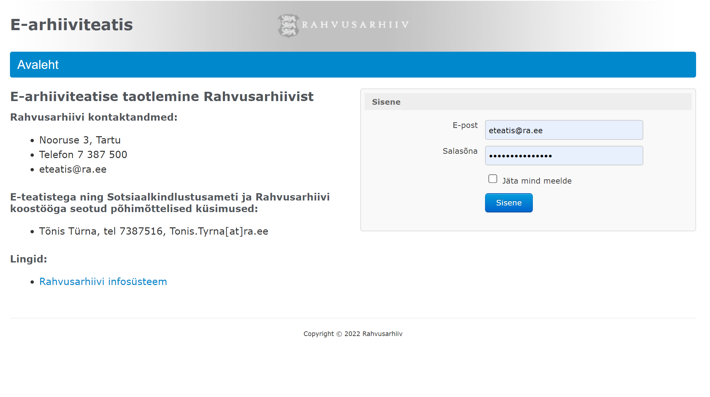
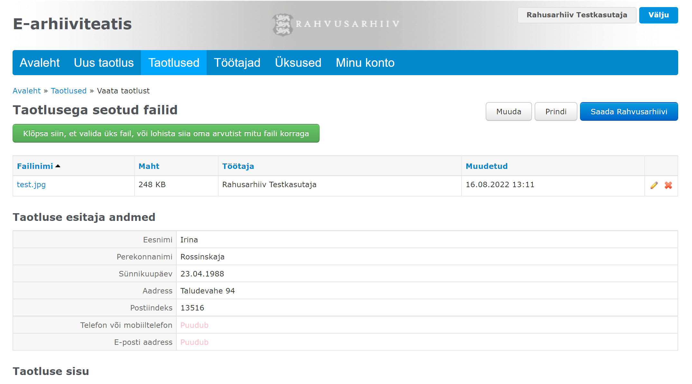
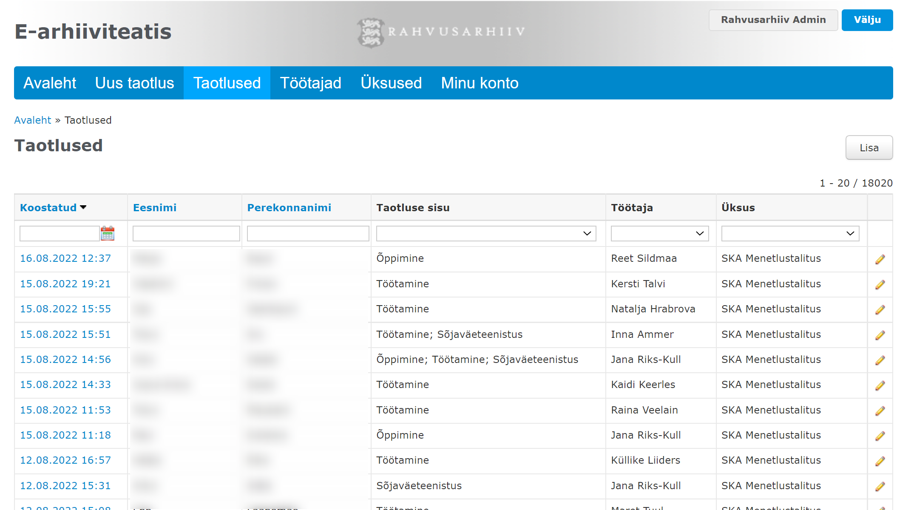
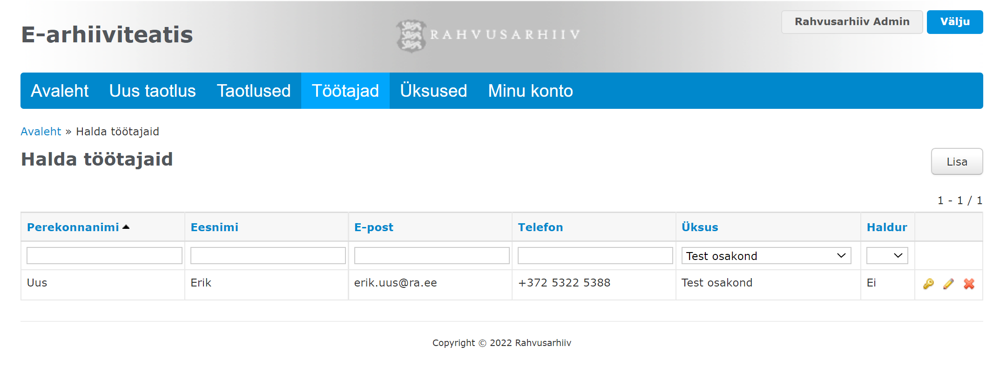

# Sissejuhatus

## Veebirakendus

Alates 2013. aastast on Sotsiaalkindlustusameti töötajad saanud kasutada Rahvusarhiivi loodud ja Rahvusarhiivi domeenis asuvat veebirakendust [https://www.ra.ee/eteatis/](https://www.ra.ee/eteatis/), et taotleda sealtkaudu Rahvusarhiivilt e-arhiiviteatisi.

Nimetatud veebirakendus võimaldab luua, muuta ja kustutada e-arhiiviteatise taotlusi, kasutajaid (SKA töötajaid, kes taotlusi koostavad) ja üksuseid (SKA osakondi, millesse töötajad kuuluvad). Loodud taotlustele on võimalik lisada faile ja lõplikult vormistatud taotlused saab saata Rahvusarhiivi, nii et need laekuvad Rahvusarhiivi arhiiviteatiste menetlemise moodulisse.

Veebirakendus on selles mõttes autonoomne, et selle kasutajad (SKA töötajad) saavad kõiki vajalikke tegevusi teha ilma välise abita (Rahvusarhiivi töötajate abita).&#x20;

**Veebirakenduse ekraanivaated**

 

 

 

## API

E-arhiiviteatise taotlemise API, mida käesolev veebilehekülg dokumenteerib, toetab kõiki samu funktsioone, mida ülalmainitud veebirakendus.&#x20;

API kaudu saab luua, muuta ja kustutada e-arhiiviteatise taotlusi, kasutajaid (SKA töötajaid, kes taotlusi koostavad) ja üksuseid (SKA osakondi, millesse töötajad kuuluvad). Loodud taotlustele on võimalik lisada faile ja lõplikult vormistatud taotlused saab saata Rahvusarhiivi, nii et need laekuvad Rahvusarhiivi arhiiviteatiste menetlemise moodulisse.

Niisiis on selle API abil võimalik luua mistahes teise infosüsteemi osana mistahes domeeni alla kasutajaliides, mis sarnaneb Rahvusarhiivi loodud rakendusega[ https://www.ra.ee/eteatis/](https://www.ra.ee/eteatis/).

**API ekraanivaated (Postman)**
