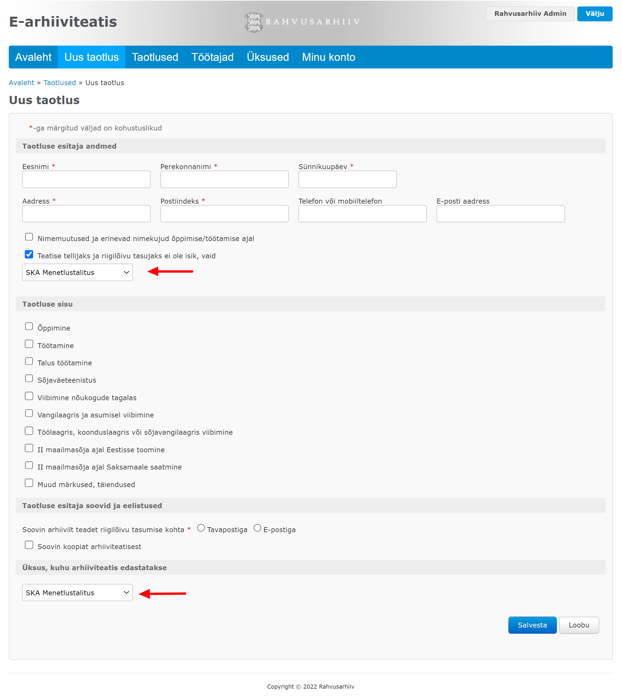

# Sissejuhatus

## Veebirakendus

Alates 2013. aastast on Sotsiaalkindlustusameti töötajad saanud kasutada Rahvusarhiivi loodud ja Rahvusarhiivi domeenis asuvat veebirakendust [https://www.ra.ee/eteatis/](https://www.ra.ee/eteatis/), et taotleda sealtkaudu Rahvusarhiivilt e-arhiiviteatisi.

Nimetatud veebirakendus võimaldab luua, muuta ja kustutada e-arhiiviteatise taotlusi, kasutajaid (SKA töötajaid, kes taotlusi koostavad) ja üksuseid (SKA osakondi, millesse töötajad kuuluvad). Loodud taotlustele on võimalik lisada faile ja lõplikult vormistatud taotlused saab saata Rahvusarhiivi, nii et need laekuvad Rahvusarhiivi arhiiviteatiste menetlemise moodulisse.

Veebirakendus on selles mõttes autonoomne, et selle kasutajad (SKA töötajad) saavad kõiki vajalikke tegevusi teha ilma välise abita (Rahvusarhiivi töötajate abita).&#x20;

**Ekraanivaated**

 

 

 

## Want to jump right in?

Feeling like an eager beaver? Jump in to the quick start docs and get making your first request:


[quick-start.md](quick-start.md)


## Want to deep dive?

Dive a little deeper and start exploring our API reference to get an idea of everything that's possible with the API:


[api-reference](reference/api-reference/)

