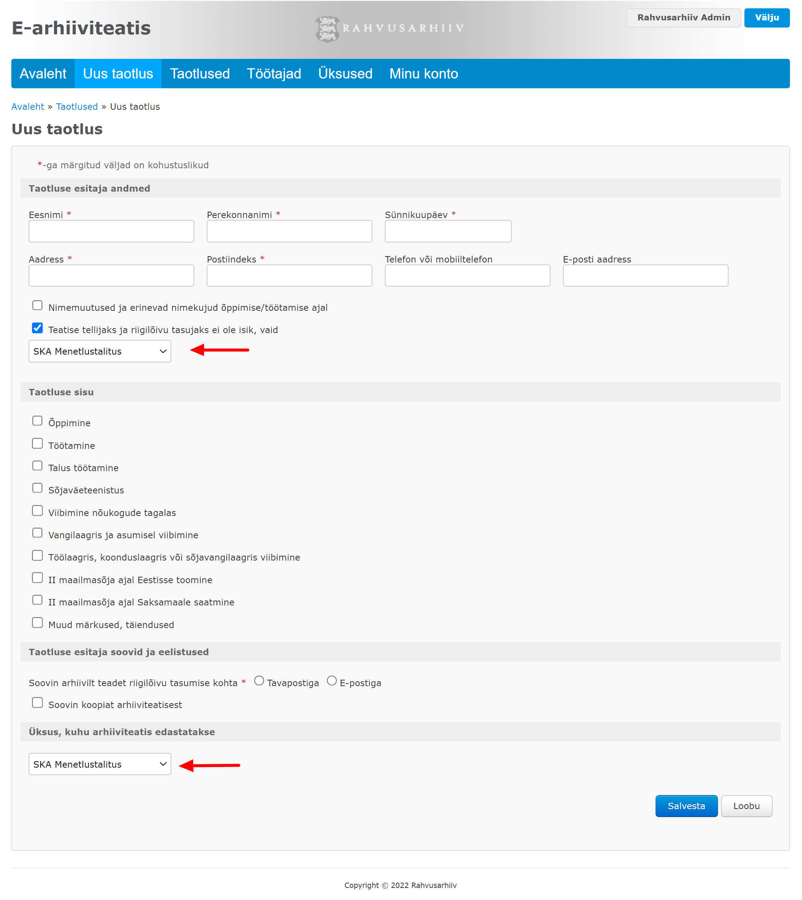
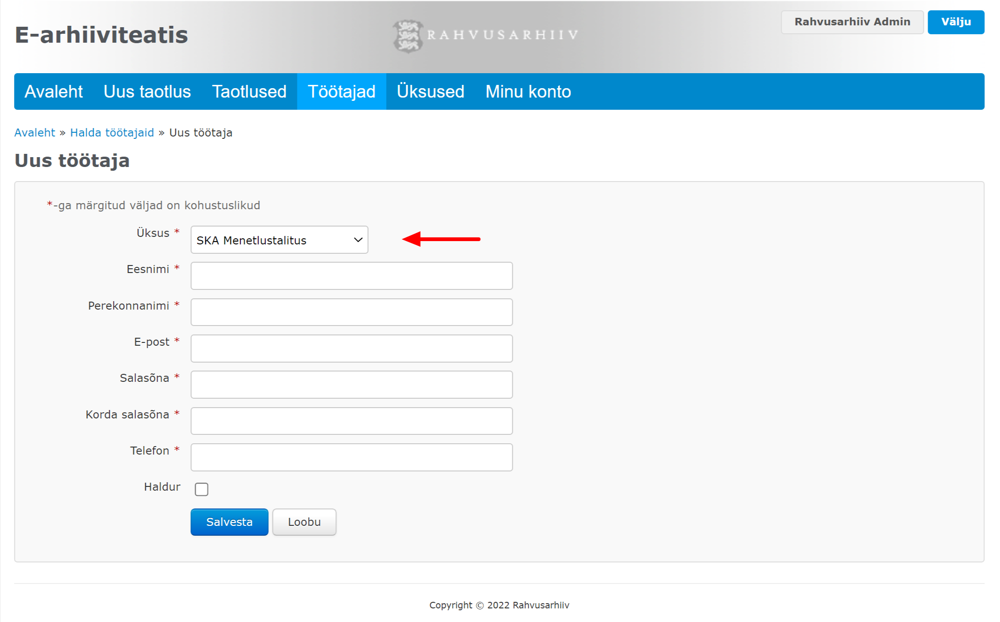

# Üksus

E-arhiiviteatise taotlusel tuleb kahes kohas määrata Sotsiaalkindlustusameti üksus:

* Juhul kui teatise tellijaks ja riigilõivu tasujaks ei ole isik, vaid Sotsiaalkindlustusameti üksus, tuleb taotlust luues määrata, milline üksus.
* Iga taotluse puhul tuleb määrata üksus, kuhu arhiiviteatis meilitsi edastatakse.


[taotlus.md](../taotlus.md)


Samuti tuleb iga töötaja puhul määrata, millisesse üksusesse ta kuulub.


[toeoetaja.md](../toeoetaja.md)


**Veebirakenduse ekraanivaated**

 

## Päringud


[testimine.md](testimine.md)



[ueksuse-loomine.md](ueksuse-loomine.md)

